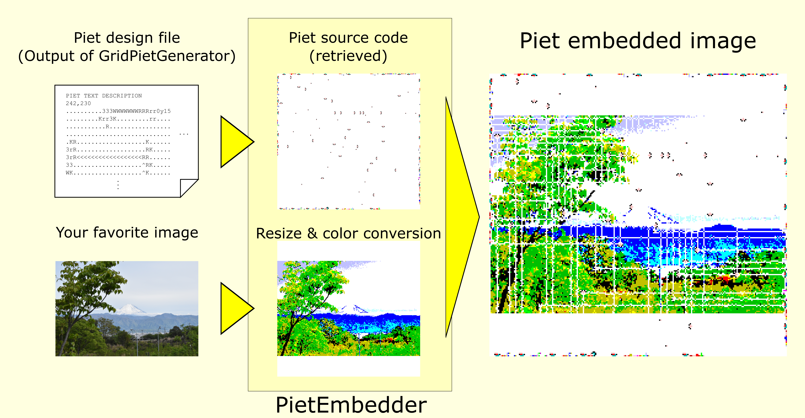
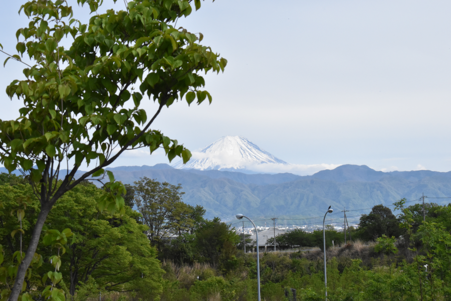
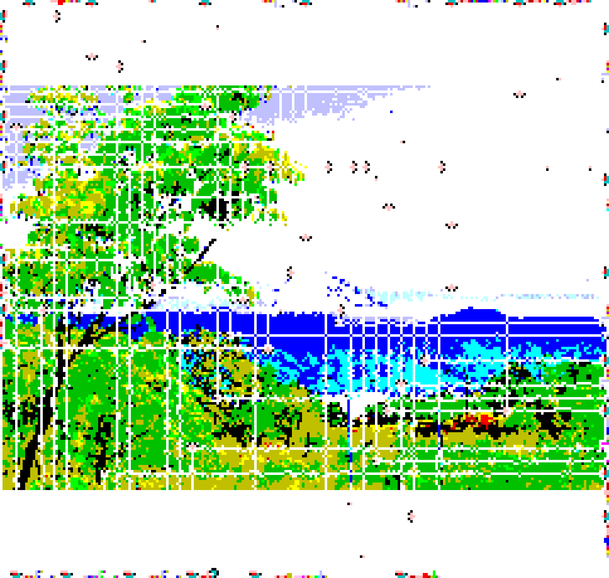

# PietEmbedder
Embed Piet source code in any image

## Readme in English
README in English may be coming soon...

## 概要
任意の画像に難解プログラミング言語[Piet](https://www.dangermouse.net/esoteric/piet.html)の
ソースコードを埋め込むツール(C++)です。
ソースコードの自動生成ツールである[GridPietGenerator](https://github.com/Y-mos/GridPietGenerator)が必要です。



## 手順
1. [GridPietGenerator](https://github.com/Y-mos/GridPietGenerator)を使って、「Piet配置ファイル」を出力する。
2. Pietソースコードを埋め込む画像を用意する。
3. 「Piet配置ファイル」と画像を入力として、PietEmbedderを実行する。
4. やったぜ。

## 使用例
hello,worldを以下の画像に埋め込みます。

> 

[GridPietGenerator](https://github.com/Y-mos/GridPietGenerator)で、hello,worldの
「Piet配置ファイル」（[hello_world_out.txt](samples/GridPietGenerator/hello_world_out.txt)）を用意し、
本ツールを使用すると、次の画像が出力されます。
> 

この画像をPietインタプリタである[npiet](https://www.bertnase.de/npiet/)（Erik Schoenfelder氏製作）で
実行すると、hello, worldできていることがわかります。
```
hello,world
```

[npiet](https://www.bertnase.de/npiet/)によるトレース画像は以下の通りです。
> 

以上で「hello,worldする富士山」の完成です。

## 特徴
+ [GridPietGenerator](https://github.com/Y-mos/GridPietGenerator)の特徴を生かし、画像へのPiet埋め込みを実現しています。
  + 複雑な処理にすればするほど、[GridPietGenerator](https://github.com/Y-mos/GridPietGenerator)の出力サイズが大きくなるので、一層元の画像が鮮明に見えます。
+ 画像中央がインタプリタの通路になるため、白色の格子縞が入りますが、元の画像の色を残しても問題ない箇所は、なるべく元の画像の色を残すように工夫しています。

## ビルド
### 要件
+ C++のコンパイラ
+ OpenCV (3.2.0で動作確認済み)

### 手順
cmake使えます。
+ 要件：version >= 2.8

```
git clone https://github.com/Y-mos/PietEmbedder.git
cd PietEmbedder
mkdir build
cd build
cmake ..
make
```


## 使い方
### PietEmbedder
###### コマンド
```
./PietEmbedder (Piet配置ファイル名) (埋め込み先画像ファイル名) (出力画像ファイル名)
```

###### 出力例
例えば、上記使用例の場合は、次のコマンドを実行すれば、結果ファイル「out.png」が出力されます。
```
./GridPietInterpreter hello_world_out.txt mt_fuji.png out.png
```

※なお、「Piet配置ファイル」（samples/GridPietGenerator/hello_world_out.txt）は、
[GridPietGenerator](https://github.com/Y-mos/GridPietGenerator)を使って、
「処理フローファイル」（[hello_world.txt](samples/GridPietGenerator/hello_world.txt)）から生成します。
（「hello_world.ppm」は、画像埋め込みには使いません。）
```
./GridPietGenerator hello_world.txt hello_world.ppm hello_world_out.txt
```

## 出力画像のフォーマット
OpenCVで扱えるものなら何でもOKです。
拡張子から自動判定されます。
ただし、jpegなどの画像圧縮を伴うフォーマットは避けてください。
(png、bmp、tiffなどがよいでしょう。)

## ライセンス
BSD 3-Clause License ([LISENCE](LICENSE))参照

## 問合せ / Contact
Y-mos

E-mail:ymos.36e17a7047@gmail.com
